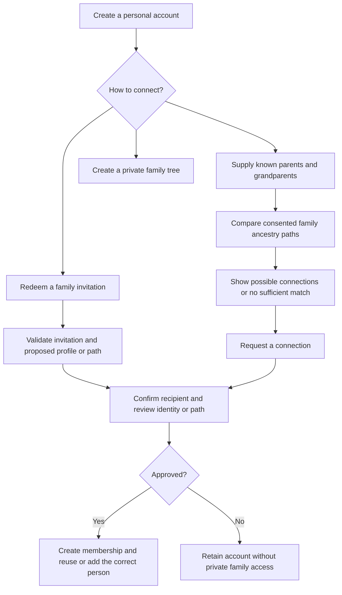

# Kkevo: business logic review and execution plan

Reviewed 3 October 2026 against the current local source, version **1.0.0+1**.

This records the engineering analysis made on 3 October. Implementation of verified joining and the Android workflow began afterward; see `FAMILY_JOINING_IMPLEMENTATION.md` for the current behavior and limits. The findings below describe the earlier reviewed state. This plan is not a claim that all phases have been completed. Existing runtime evidence comes from the previous repair and testing passes. This review adds source analysis; it does not rerun every test or change app behavior.

## 1. The idea expressed by the app

Kkevo helps a family preserve its identity and history across generations. Its core asset is a maintained set of people and recorded relationships, with biographies, portraits, customary names, village of origin and clan information. Tree navigation and kinship calculation make those records understandable. Accounts, personal Heritage Keys and backups support access and continuity.

The user clarified the intended participation model during this review: a new account should be able to find candidate family connections using recorded parent/grandparent information, or join an existing branch through an invitation tied to that lineage. This makes **verified family joining** a central business workflow. The royal and customary presentation indicates a cultural focus, but a validated cultural glossary, dispute authority and commercial model still need definition.

The recommended model is **private family trees with verified invitations first, then controlled family-matching suggestions**. Multiple trees already exist and should be preserved. A matching result is a candidate for review, not proof of identity or permission to enter a family. Broad public discovery, automatic cross-tree record merging and monetization are outside this execution plan.

The useful business outcome is: a family can create accurate records, understand their connections, control access, correct mistakes and preserve the archive independently of a single device or account.

## 2. What is implemented

| Area | Current implementation | Assessment |
|---|---|---|
| Accounts | Registration, password and personal Heritage Key login, session renewal, remembered account switching and logout. | Connected core workflow. Password/account recovery and ownership succession are not complete user workflows. |
| Family trees | Private-by-default trees; owner and member associations; create, choose, rename, describe and owner-delete. Public visibility exists in the API. | Working management foundation. Public visibility is coarse and has no field-level privacy policy. |
| People | Names, life dates/status, places, customary details, biography and portrait; shared create/edit forms. | Working record editor. Record identity, duplicate policy and correction history need stronger rules. |
| Relationships | Parent, spouse, sibling, adopted and step links; dates, notes, former spouses; atomic creation of a relative and optional co-parent. | Strong foundation: same-tree checks, self-link/cycle checks, rollback and retry receipts exist. |
| Exploration | Interactive tree, search, filters, person summaries, full profile, family focus and kinship calculation. | Connected UI. Complex and customary kinship semantics still need verification beyond happy-path testing. |
| Family joining | Backend owner-only add/remove-member actions. Members can edit records. | Partial: no invitation acceptance, branch/profile claim, ancestor-based matching or private viewer/editor journey. These are planned completion of the user's intended family-participation workflow. |
| Heritage Keys | Generate, list and revoke personal login credentials. Categories are explicitly descriptive in the UI. | Working authentication convenience. A key does not create an independent family-member identity or limited permission. |
| Transfer and continuity | Owner JSON import, authorized export, account-scoped cached viewing, admin database/media backup and restore. | Working foundations with limits: import adds records; JSON does not restore media files; production recovery is unverified. |
| Events, general media and tags | Backend models/APIs exist. | Backend foundations, not complete Flutter product workflows. The app's Keys tab manages credentials, not a document/audio archive. |

Recorded evidence: 57 backend tests passed in the preceding PostgreSQL test run; 30 Flutter tests passed; current code analysis is clean; the 3 October Android emulator journey passed registration, persistence, expiry/renewal, portraits, transfer, account isolation, cache and logout. These results do not prove every kinship rule or a deployed production environment. See `WORKFLOW_COMPLETION_REVIEW.md` and `PC_TESTING.md`.

## 3. Business rules that need to become explicit

### A. Account identity, family membership and a person record are different

An account identifies the operator. Membership determines that account's rights in one tree. A Person describes a family member, including someone deceased or without an account. Choosing a person as the visual focus does not prove that the signed-in user is that person.

Today `Person.user` is an optional global one-to-one link, and its API field is read-only. There is no complete verified association workflow. Decide whether an account can represent a record in each of several trees. For the pilot, leave association optional and owner-controlled; never infer identity from matching names.

### B. Rights must come from membership, not a key category

Today owner/member/superuser checks grant writes, while public trees grant reads. Every approved member can change or delete people and relationships. Heritage Key login issues a normal session for the key's user; `GUEST_VIEWER` does not limit that session. Revocation blocks subsequent key login, while existing sessions remain active.

Proposed minimum policy if collaborators are enabled:

| Operator | Read a private tree | Edit its people/links | Manage access/settings/import/delete |
|---|---|---|---|
| Owner | Yes | Yes | Yes |
| Approved editor | Yes | Yes | No |
| Approved viewer | Yes | No | No |
| Unrelated account | No | No | No |

Personal login keys retain their current meaning. An invitation must authorize the recipient's own account; it must not share the owner's credential. Customary titles should not silently grant technical access.

For initial migration, keep existing members as editors to preserve current rights, create owner memberships and verify every endpoint uses the same policy. Any deliberate change to existing access needs an explicit migration decision.

### C. Recorded facts must retain their meaning in derived kinship

Direct adoptive and step labels are handled, but the solver then merges biological, adoptive and step edges into one parent map for indirect calculations. Some descriptions can imply biological ancestry where the recorded path includes a social relationship.

Two concrete source findings:

- A shared current spouse triggers the co-wife result without checking the genders or an explicit customary convention (`kinship_solver.dart`, around line 203).
- The uterine nephew/niece branch checks the querying person's gender rather than the relevant sibling-parent's gender (`kinship_solver.dart`, around line 504).

Retain relationship type and direction on every path. Describe the recorded connection first. Apply a customary interpretation only when the family-approved rule and required facts support it. Ambiguous paths should remain explainable without inventing a single authoritative label.

Generation tier is currently editable and defaulted in the Flutter relative form; it is not a universally enforced graph invariant. Separate this display grouping from graph-derived kinship distance. Do not assume every spouse or complex pedigree can satisfy one universal generation number.

### D. Corrections must not silently destroy history

People with matching names are not necessarily the same person. API person validation calls `clean()` and disables serializer uniqueness validators; JSON import calls `full_clean()`, which also checks model uniqueness. The legacy name/date uniqueness rule and nullable dates therefore do not provide one consistent identity policy across entry points.

Use record IDs for identity, warn about possible duplicates, and make corrections explicit. Keep unknown facts unknown: import currently defaults missing gender to `M`, whereas app creation defaults to `O`. Align that behavior. Do not require fabricated dates or automatically merge namesakes.

Current records have timestamps but no dedicated author/revision history. Row locks protect several compound graph writes, but they do not tell a second editor that their form is stale. Introduce revision checking and a minimal actor/change trail before depending on collaborative editing. Show the latest record on conflict and retain the user's draft.

### E. Family history must survive account and transfer operations

The model currently cascades deletion from an owner account to its trees and from a linked account to its Person record. These are model/admin deletion risks; the app does not currently expose an account-delete endpoint. Define deactivation, reassignment and deletion separately. Prefer protected tree ownership and a detachable account-to-person association, with an owner-transfer process when needed.

JSON import is atomic for one request but has no replay receipt and intentionally adds new records. A lost response followed by a retry can be confusing or duplicate data. Define a copy operation versus a retry of the same operation, preserve destination authorization and give an import receipt. Do not call JSON export a complete backup.

Keep the first release private by default. The current public switch exposes person-record fields rather than a separate minimal public profile. A public release requires an explicit decision about living-person information and linked account details.

### F. Joining must connect the correct person and the correct path

An invitation and a Heritage Key are different. A Heritage Key signs into its owner's account. A family invitation is redeemed by the recipient's own account and carries a server-controlled tree, anchor person, intended relationship or existing target profile, granted membership role, expiry and use limit. Store a digest of the invitation secret, allow revocation and rate-limit redemption. A family name, database ID or easily guessed family fact is not an invitation credential.

Support two explicit outcomes:

1. **Claim an existing profile:** the owner issues an invitation for an existing Person. Acceptance confirms the recipient and reuses that record, including its existing parent/grandparent links. It must not create a duplicate Person or overwrite its biography.
2. **Join through a known relative:** the invitation anchors a parent or grandparent and specifies the intended relationship. Review the proposed path before linking. Joining as a grandchild needs the intermediate parent identified or recorded; never create a direct parent link from grandparent to grandchild. A branch is initially a graph path/root, not a new permission boundary. Tree-wide versus restricted branch visibility must be explicit before promising either.

For the first release, grant approved participants viewer access by default; the owner deliberately upgrades an editor. An invitation created for a specific account can be accepted by that account. For an unbound recipient, hold the person claim/new graph links for owner confirmation; possession of the code alone should not silently claim a living person's identity. Claims transition `PENDING → APPROVED / REJECTED / CANCELLED`; invitations transition `ACTIVE → REDEEMED / REVOKED / EXPIRED`. Approval must atomically create membership, associate the account and apply validated links. Race/retry handling must prevent two accounts from claiming the same profile.

### G. Matching must use evidence, consent and review

After account creation, offer three paths: **use an invitation**, **find a possible family connection**, or **create a new family**. Ancestor input is optional for basic account access. Missing information must not exclude a legitimate family member.

Use supplied names and optional birth information/places for the applicant, parents and grandparents. Normalize spaces, case and accents consistently, retain original names and record which facts are unknown. Compare these against consistent paths in an opted-in family's graph, rather than searching for a single similar surname.

Initial deterministic rules:

- A surname or one ancestor name alone is insufficient to suggest a private family connection.
- A compatible known-parent identity plus a recorded grandparent path is stronger evidence than isolated matching names. Dates and places can support or contradict the candidate; gender or clan alone must not establish identity.
- Keep each supporting and conflicting fact with the candidate. Do not label a handcrafted score as a probability or use an uncalibrated percentage.
- Return several candidates when the evidence is ambiguous. Unknown dates are missing evidence, not contradictory evidence. Conflicting facts require correction/review before linkage.
- Matching does not grant membership or reveal the underlying private graph. A candidate supports an owner-reviewed join request. No automatic cross-tree merge or claim is performed.

Use explicit family opt-in for discovery. Keep matching server-side; return a minimal consented family label and a request route rather than living-person dates, names, portraits or a searchable raw graph. Define attempt limits and data retention for pending requests. Families that do not opt in remain invite-only. Until these privacy and authority rules are accepted, matching must stay disabled for their records.

Example: Anna supplies Paul as her father and Mariam as Paul's mother. A candidate tree containing `Mariam → Paul → Anna` can support claiming its existing Anna record, or `Mariam → Paul` can support a proposal to add Anna. A tree with a different Mariam disconnected from Paul is not equivalent. The owner confirms identity and the actual parent path before membership/claim approval.

## 4. Execution sequence

### Phase 0 — Freeze the pilot rules

**Deliver:** a short agreed rule sheet covering owner/editor/viewer powers, account-person association, invitation recipient/anchor rules, matching consent and evidence, unknown information, meaning of `PARENT`, customary terminology, public visibility and deletion/recovery. The chosen product direction is verified invitation plus controlled ancestor matching.

**Exit:** a worked example with several generations, a namesake, adoption, step-parent, former spouse, unknown dates and a person without an account. Include an invitation for an existing profile, one grandchild proposal and two ambiguous matching candidates. Each expected result and allowed operator action is written down.

### Phase 1 — Correct the existing family logic

**Work:** preserve typed kinship paths; fix overly broad customary classifications; distinguish display generation from relationship distance; align person validation across API/import; use neutral unknown defaults; specify duplicate warnings and relationship-date/current-status consistency. Reuse current transaction locks and relative retry receipts. Verify import and other write paths use a consistent lock order when they modify the same graph.

**Code areas:** `backend/family/models.py`, `serializers.py`, `views.py`; `backend/data_management/views.py`; Flutter `kinship_solver.dart`, `genealogy_helper.dart`, models and existing editors.

**Exit:** fixtures prove direct/indirect biological, adoptive and step paths; half/full and explicitly recorded siblings; former unions; multiple current partners; neutral genders; disconnected branches and multiple possible paths. API creation, partial edit, relative creation and import agree on accepted facts. Invalid writes leave the graph unchanged. Existing successful workflows remain green.

### Phase 2 — Deliver verified invitation joining

**Work:** add explicit per-tree viewer/editor membership and connect owner add/remove-member actions to the existing tree manager. Implement issue/revoke/redeem invitations, existing-profile claims, relative-path proposals and owner review. Include expiry, one-use redemption and replay handling. Keep Heritage Keys personal. Define account recovery and owner reassignment; prevent accidental cascades from deleting the archive.

**Code areas:** tree/user models, permissions, membership actions and account routes; Flutter registration follow-up, tree manager, account UI and API service. Preserve the existing personal-key explanation. Include new membership/invitation/claim structures in backup/restore. Replace or supersede the global Person.user association only after defining per-tree account mapping and migrating legacy links safely.

**Exit:** a separately registered account accepts an invitation and lands on the intended profile/branch after approval. Existing profiles are reused. A grandchild has the correct two-edge path. Expired/revoked codes, a wrong recipient and replayed claims cannot create access or duplicate links. Two competing claims produce one approved association. A viewer cannot mutate via UI or direct API; an editor cannot manage ownership/import/tree deletion; removal blocks fresh authorized requests. Define treatment of already downloaded data and signed media links rather than promising remote deletion. Failed association/transfer changes nothing.

**Pilot milestone:** this phase delivers the first usable shared-family business workflow. Invite-based joining can launch to a controlled pilot before automated family suggestions are enabled.

### Phase 3 — Add evidence-based family suggestions

**Work:** add optional parent/grandparent onboarding, family discovery consent, a server-side normalized matching service and minimal candidate responses. Reuse Phase 2's claim/review process when a user requests a connection. Store input consent, rule-version, evidence and decision outcome with the request; avoid a global public person search.

**Code areas:** a new matching service and request models in the backend family domain; account onboarding and a bounded suggestion/review UI in Flutter. No machine-learning service is needed for the initial explicit rules.

**Exit:** test fixtures distinguish shared surnames, identical ancestor names in unrelated families, consistent two-generation paths, different places/dates, unknown facts and multiple legitimate candidates. Adoptive/step links stay typed. A non-opted-in family never appears; rejected/ambiguous suggestions never create access; API responses expose only approved discovery fields. Evaluate known correct and incorrect fixture pairs before choosing a suggestion threshold, then validate with consented pilot examples and owner review. Do not claim impossible-to-falsify matching or guaranteed genealogy from entered facts.

### Phase 4 — Make edits and transfers recoverable

**Work:** introduce revision conflict checks and a minimal correction trail on existing record operations; add retry receipts to import; show destination/counts and explain copy semantics; define a safe correction/deletion recovery path. Extend backup coverage for any new models. Avoid automatic person merging in this pass.

**Code areas:** a reusable domain write layer under `backend/family/`, transfer services, serializers and backup service; existing Flutter save/delete/import dialogs and API service.

**Exit:** simultaneous edits never silently overwrite an unseen revision; actor attribution is retained; retrying the same completed import returns its original result; a deliberately new copy remains possible. Failed imports do not change records. A rehearsal restores records, links, memberships and media together.

### Phase 5 — Validate the pilot release

**Work:** repeat the existing regression suites and native journey with the new domain cases; use independent owner/editor/viewer accounts where enabled; test the gallery picker, keyboard/back navigation, accessibility and representative larger graphs on supported phones. Validate a privately signed release against the actual HTTPS production backend. Rehearse operational backup recovery and record who handles failures.

**Exit:** a new family can register, create a private tree, record and explain relationships, add biographies/portraits, invite a participant to the correct branch and approve an ancestor-based join request. The participant uses their own identity and only intended rights. Families can correct errors, transfer records and recover their archive. No unrelated account can read or modify private records. Production recovery and device evidence are recorded. iOS requires its own build/device evidence if included in the release scope.

Dependencies: **pilot rules → domain correctness → invitation/access/claims → matching suggestions → full release validation**. Conflict/recovery guarantees must ship before collaborative editing is enabled; Phase 4's edit protection therefore runs alongside Phase 2 rather than waiting for matching. An invitation-only pilot does not require completing matching first.

## 5. Engineering approach

Keep Flutter and Django; the current product does not require a rewrite. Put authoritative authorization and write rules in backend services reused by normal editing, relative creation, import and supported admin paths. Keep UI validation for immediate feedback, with the backend enforcing the contract. Kinship can remain a pure calculation over a typed graph, separated from cultural wording and presentation.

Use additive migrations and backfill first. Preserve existing owner/member behavior until a deliberate role migration is verified. Audit current data read-only for duplicate candidates, missing facts, conflicting generation labels and public trees; do not automatically repair historical records. Test migrations and restore against an isolated copy before touching real data.

Every implementation item should carry its business rule, affected entry points, migration impact and an observable acceptance case. Screens are complete only when permission, failure, retry, stale-session and persisted-result behavior are covered.

Proposed domain additions: `TreeMembership` (tree, account, role, status), `FamilyInvitation` (tree, anchor/target, allowed relationship, intended recipient, expiry, secret digest), `PersonAssociation` (tree, person, account, approval status), and `JoinRequest` (invitation or ancestry evidence, proposed path, reviewer, outcome). Enforce one approved account association per Person and one self association per account/tree, unless an explicit representative/guardian workflow is later defined. A recorded Person may exist without any account. Treat the same real individual represented in two trees as two separate records at this stage; do not merge them globally.

## 6. What to postpone

Do not add payments, social feeds, chat, AI-generated ancestors, public discovery, cross-tree person merging or extra ceremonial roles during this pass. Backend events/media/tags should remain outside the first-release claim unless the chosen family workflow specifically requires them. A life timeline would also need a policy for reconciling Event birth/death records with Person life dates; it should not simply duplicate editable facts.

There is no implemented pricing/subscription workflow in the inspected source. Define the operating audience and who maintains the archive before choosing a commercial model; do not build billing speculatively.

## 7. Source anchors

- `backend/family/models.py:6`: ownership, membership and privacy; `:30`: account/person association; `:51`: legacy identity constraint; `:137`: graph validation.
- `backend/family/permissions.py:5`: current read/write policy.
- `backend/family/views.py:65`: backend member addition; `:191`: locked atomic relative creation.
- `backend/users/views.py:138`: key login creates an account session; `:249`: key revocation.
- `backend/family/serializers.py:84`: person serializer uniqueness validators; `:91`: model-clean validation.
- `backend/data_management/views.py:150`: atomic append import; `:168`: missing-gender default; `:180`: full model validation.
- `flutter_frontend/lib/utils/kinship_solver.dart:85`: adoptive/step aggregation; `:203`: co-wife classification; `:504`: uterine branch.
- `flutter_frontend/lib/widgets/relative_editor_dialog.dart:90`: client generation defaults.
- `flutter_frontend/lib/views/vault/heritage_vault_view.dart:79`: personal credentials and descriptive categories.

**Recommended first implementation:** Phase 1's typed kinship rules and consistent record validation, followed immediately by Phase 2's invitation-based account-to-profile joining. This establishes a trustworthy family graph and identity path for Phase 3's parent/grandparent matching.
